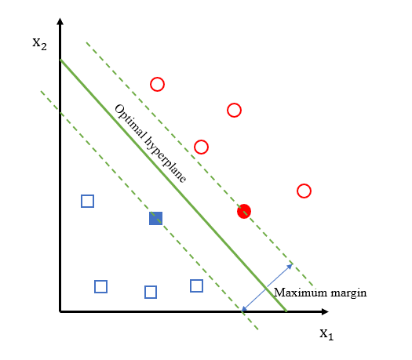

# Prediction Model Based On Neural Activity Data In Mouse Brain

## Abstract

With the advent of big data and artificial intelligence, the power of data is gradually being harnessed. Through data analysis, potential hidden knowledge can be unearthed, thereby better completing tasks such as describing and predicting data, and better assisting users in making decisions and analyses. This project uses neural activity data from mouse brains for data analysis. Firstly, the raw data was analyzed in terms of data structure, pre-processed and analyzed for data distribution. Then, data integration and PCA dimensionality reduction were performed, and support vector machines, decision trees, and logistic regression were used to establish prediction models for the integrated data set. Predictive analysis was carried out on the integrated data set, and finally, the accuracy, precision, recall rate, and F1 value were calculated using a confusion matrix to analyze the predictive results.

**Key words**:Data analysis; Support Vector Machine; Decision Tree; Logistic Regression; Confusion Matrix.

## 1 Introduction

In this project, a data set of mouse visual cortex neuron activity collected by Steinmetz et al. The data generated by each small experiment include the neuron spike sequence from multiple areas of the mouse brain from the beginning of the mouse stimulation to 0.4 seconds after the onset of the disease, recorded every 0.01 seconds, and the value of the neuron spike sequence is 0 or 1 means, 0 means that the synapse of neurons in this area is not stimulated, and 1 means that the synapse is stimulated. In addition, the mice were tested in response to visual stimuli, recording differences in the contrast levels of the stimuli, including left-right contrast. The behavioral feedback results of the mice can be obtained through the neural activity data of the mice and the visual stimuli.

This project aims to predict the outcome of each trial (i.e. feedback type) by using neural activity data (i.e. spike training) along with visual stimulus conditions (left-right comparison).

## 2 Exploratory analysis

This section makes a preliminary analysis of the basic situation, data quality inspection and data distribution of the mouse neuron activity data set used in the project.

### 2.1 Basic situation of the data set

The data for this subject consisted of 18 sessions involving 4 different mouse species. Variables used in the project included mouse name for a particular session, date of experiment, unique brain region involved, number of neurons, number of trials in each session, and the ratio of successful trials to the total number of trials, as shown in the table below:

```{r message=FALSE, warning=FALSE, echo=FALSE}
session=list()

information_mouse <- NULL

for(i in 1:18){
  session[[i]]=readRDS(paste('./Data/session',i,'.rds',sep=''))
  
  mouse_name <- session[[i]]$mouse_name
  date_exp <- session[[i]]$date_exp
  n_brain_area <- length(unique(session[[i]]$brain_area)) # 8
  n_neurons <- length(session[[i]]$brain_area) # 731
  n_treails <- length(session[[i]]$contrast_left) # 114
  # success_rate =  # 0.61
  # Count the value in session[[i]]$feedback_type, if it is 1, then success_rate+1
  success_rate <- sum(session[[i]]$feedback_type == 1)/n_treails
  success_rate <- round(success_rate,2)
  # print(paste(mouse_name,date_exp,n_brain_area,n_neurons,n_treails))
  information_mouse <- rbind(information_mouse, c(mouse_name,date_exp,n_brain_area,n_neurons,n_treails,success_rate))
}
colnames(information_mouse) <- c("mouse_name","date_exp","n_brain_area","n_neurons","n_treails","success_rate")
infomation_nouse <- as.data.frame(information_mouse)
# show infomation_nouse
information_mouse

```

**Neural activity during exploration**

```{r message=FALSE, warning=FALSE, echo=FALSE}

# Define a list for storing data
# for (j in 5:5){
  result <- NULL
  # for (i in 11:11){#length(session[[j]]$spks)) {
    j <- 5
    i <- 11
    df <- data.frame(matrix(unlist(session[[j]]$spks[[i]]), ncol = ncol(session[[j]]$spks[[i]]), byrow = TRUE))#1077*40 --> 1077*1 
    # print(dim(df))

    # sum each row of df
    row_sum <- apply(df, 1, sum)

    # draw a bar graph
    barplot(row_sum, main = "Sum of Rows", xlab = "Rows", ylab = "Sum")

  # }
# }
```

**Explore variation between trials**

```{r message=FALSE, warning=FALSE, echo=FALSE}
# Reduce(intersect, lapply(session[3:4], function(x) x$brain_area))
for (i in 1:18){
  #  output "session_i"
  print(paste("session",i,sep="_"))
  print(unique(session[[i]]$brain_area))
}
```

**Exploring homogeneity and heterogeneity between sessions and mice**

Homogeneity and heterogeneity test: analyze the similarities and differences between different sessions and different mice, and the similarity between different sessions and different mice. Get the brain regions shared by different sessions

```{r message=FALSE, warning=FALSE, echo=FALSE}
Reduce(intersect, lapply(session[3:4], function(x) x$brain_area))
```

### 2.2 Data cleaning

In this project, the following data cleaning operations were performed on the initial experimental data:

-   Outlier processing: convert data other than 0 and 1 to 1;

-   Missing value processing: add 0 to the missing value data;

## 3 Data integration

In this project, the mouse neuron activity data and visual stimulation data in each experiment are integrated to form a model data set.

## 3.1 Time Series Data Dimensionality Reduction

A time series is defined as a sequence of quantitative values obtained in continuous time, usually with equal intervals. For example, the mouse neuron activity data used in this project records 40 neuron spikes within 0.4 seconds, which is a time series data.

The rise of big data and the use of smart devices has demonstrated the need for powerful compression techniques that can meet the processing needs of industries that rely on time-series data. At high frequencies (around 10kHz), even databases that specialize in time-series data can be overloaded, and time-series compression algorithms are widely studied for their high value returns.

Performing time series data dimensionality reduction can help us store, transmit, compute and visualize data more efficiently while improving data quality and accuracy. In this project, PCA is used to reduce the dimensionality of mouse neuron activity data, and the value of 40 spike sequences within 0.4 seconds of each mouse neural region is reduced to 1 dimension, that is, a single value is used to represent the spike sequence of a single neural region within 0.4 seconds.

After PCA dimensionality reduction for each session data, the number of principal components is averaged to extract sharing patterns across sessions and/or; in order to solve the differences between sessions, standardize and normalize the data, and then merge the data.

### 3.2 Dataset construction

In this subject, based on the PCA dimensionality reduction algorithm, the session2\~17 mouse data set is uniformly extracted to share patterns and/or across sessions. After that, the number of principal components is averaged after PCA dimensionality reduction for each session data To solve the differences between sessions, a dataframe data set with 4000+ rows and 49 columns was obtained for the next training and prediction.

## 4 Predictive modeling

This section mainly introduces the forecasting model used in the project and the preprocessing operation of the data before forecasting.

### 4.1 Data preprocessing

#### 4.1.1 Data dimensionality reduction

PCA, or Principal Component Analysis, is a commonly used data dimensionality reduction technique, which converts multidimensional data into a low-dimensional form through linear transformation, thereby reducing the amount of data, simplifying the model, and reducing computational complexity.

The goal of the PCA algorithm is to find a new coordinate system by preserving the maximum variance of the data, so that the original data can be better displayed in the new coordinate system. By retaining the main principal components, we can better understand the data, discover the correlation between the data, remove unimportant information and noise, and improve the visualization effect and modeling accuracy of the data.

Due to the high dimensions of the integrated data set, this subject uses PCA to reduce this problem, and calculates and analyzes the cumulative variance contribution rate of the principal components during the execution of PCA to obtain the optimal number of principal components for each session. Then calculate the mean value to obtain the most common principal component number with certain universality. Finally, reduce the data to 49 dimensions.

#### 4.1.2 Data standardization

A common method in data normalization feature scaling, which is to scale the original data according to the feature dimension. Through standardized processing, feature data of different dimensions can be made into the same dimension, which is convenient for comparison and processing. The normalized data is distributed on a normal distribution centered at 0. Data standardization is to transform the data according to a standard normal distribution with a mean of 0 and a variance of 1, that is, the original data is converted by the following formula Convert x to normalized data z :

$$
  z = \frac{x-\mu}{\sigma}
$$

In which, μ is the mean of the data and σ is the standard deviation. Normalized data z The mean is 0, the standard deviation is 1, and the transformed data conform to a standard normal distribution. By standardizing the training data, the accuracy and convergence speed of the model can be improved.

In this topic, the above-mentioned standardization process is performed on each feature of the integrated experimental data set.

#### 4.1.3 Data division

Data partitioning is an important step in the training process of machine learning models. Reasonable data partitioning can improve the generalization ability and stability of the model, and can also avoid problems such as overfitting and underfitting of the model on the test set. In practical applications, it is necessary to select an appropriate division method according to different problems and data characteristics, and to perform reasonable data preprocessing and feature engineering to improve the performance and effect of the model.

In this project, the integrated mouse neural activity data set is randomly divided into training set data and test set at a ratio of 8:2, the model is trained on the training set, and the overall performance of the model is evaluated on the test set to judge Whether the model has a certain generalization ability.

### 4.3 Predictive model

In this topic, the classification models of support vector machine, decision tree and logistic regression are used to predict the neuron activity data of mice. The following is an introduction to the three models.

#### 4.3.1 Support Vector Machines

Support Vector Machine (SVM) is a fast and reliable linear classifier that performs very well with limited amounts of data. Given training data, the basic idea of SVM is to find a hyperplane that separates data points of different classes. The choice of this hyperplane is based on maximizing the distance between the support vectors and the hyperplane, so that the classification boundary is more robust and has good generalization performance. As shown below :



What an SVM does is find a line (or hyperplane) that has the greatest minimum distance from the training samples, such as the thick green line through the center in the image above.

In SVM, data points are mapped to high-dimensions through kernel techniques, so that the data that is originally linearly inseparable becomes linearly separable in high-dimensional space, and the most commonly used is radial basis function (RBF). In addition to classification tasks, SVM can also be used for regression tasks, anomaly detection, etc.

In practical applications, SVM has been widely used in text classification, image classification, bioinformatics, financial risk assessment and other fields, and achieved excellent results.

#### 4.3.2 Decision tree

Decision tree classification algorithm can infer classification rules from a set of seemingly disordered and irregular cases without knowing the relevant fields of the cases or the relationship between data features, and it is effective and fast. Decision trees are generally constructed by a top-down recursive divide-and-conquer approach. As the decision tree is built step by step, the dataset is recursively divided into smaller partitions based on the characteristics of the objects being classified. In each partition obtained by each division, each tuple tends to be more of the same type than before the division, that is, the proportion of tuples tending to the same type in the partition is larger. This achieves the purpose of classification.

#### 4.3.3 Logistic regression

Logistic regression is a technique used to model binary classification problems. It is a classification algorithm used to predict the likelihood that an input data belongs to a certain category. It can be used to predict whether a certain event will occur, such as whether a user will buy a certain product. , will click on a certain link, etc. In this topic, logistic regression is used to predict the activity feedback of mice. The basic principle of logistic regression is that it uses a series of input variables to represent the input data, and then builds a model to predict the possibility of the input data belonging to a certain category. The logistic regression model uses a similar logistic function to calculate the possibility of input data, called the Sigmoid function, as follows: $$
g(z)=\frac{1}{1+e^{-z}}
$$

By using Logistic regression, model parameters are adjusted to maximize the probability of model predictions. It can optimize model parameters by least squares or gradient descent.

The advantages of logistic regression are that it can easily handle a large number of input variables, it handles non-linear relationships well, and it handles data noise well. It also handles contextually well, solving problems that traditional machine learning algorithms cannot.

In summary, logistic regression is a flexible and effective classification algorithm that can be used to model binary classification problems and can easily handle a large number of input variables and data noise. Its maximum likelihood estimation and gradient descent algorithms can adjust the model parameters so that the model parameters maximize the predicted probability.

## 5. Predictive performance on the test set

Based on the confusion matrix, the experiments in this project evaluate the prediction results of the model by calculating indicators such as accuracy rate, precision, recall rate, and F1 value.

### 5.1 Experimental indicators

A confusion matrix is a common tool for evaluating classifier performance, it shows the difference between actual and predicted labels, Confusion matrices and evaluation metrics are usually used for tasks such as selecting models, adjusting model parameters, and evaluating feature importance, which are of great significance in many machine learning applications. A confusion matrix is usually a 2\*2 table, where rows represent true labels and columns represent predicted labels. A simple confusion matrix is shown in the table below:

```{r message=FALSE, warning=FALSE, echo=FALSE}
actual <- c(1, 0, 1, 0, 1, 0)
predicted <- c(1, 0, 1, 1, 1, 0)
confusion_matrix <- table(actual, predicted)

confusion_matrix
```

Based on the confusion matrix, some evaluation indicators can be calculated, such as accuracy rate, precision, recall rate, F1 value, etc. 

### 5.2 the result of the test data's prediction

Based on the above prediction indicators, this topic conducts prediction experiments on the mouse neural feedback data. Here we read the test set of test1 and test2 data after unified and regular processing. The trained logistic regression, SVM and decision tree models were loaded, and the test data were predicted. The experimental results are shown below:

```{r message=FALSE, warning=FALSE, echo=FALSE}
# read data
test_set <- read.csv("./Data/test_data.csv")
# delete the first column
test_set <- test_set[,-1]
# test_num = mean_num_components+3
test_num = 46 +3
```

```{r message=FALSE, warning=FALSE, echo=FALSE}
# Loading the model
load("./Data/logistic_regression.RData")

# Predicting the Test set results
prob_pred = predict(classifier, type = 'response', newdata = test_set[-test_num])
y_pred = ifelse(prob_pred > 0.5, 1, 0)

print("the performance of logistic regression")

# Making the Confusion Matrix
cm = table(test_set[, test_num], y_pred > 0.5)
print("the confusion matrix is:")
print(cm)
# calculation accuracy
acc <- sum(diag(cm)) / sum(cm)
print("the acc is:")
acc
precision <- sum(y_pred == 1 & test_set[, test_num] == 1) / sum(y_pred == 1)
print("the precision is:")
precision
recall <- sum(y_pred == 1 & test_set[, test_num] == 1) / sum(test_set[, test_num] == 1)
print("the recall is:")
recall
f1 <- 2 * precision * recall / (precision + recall)
print("the f1 is:")
f1
```

```{r message=FALSE, warning=FALSE, echo=FALSE}
#logistic regression svm decision tree predictive modeling
# Fitting SVM to the Training set
# install.packages('e1071')
library(e1071)


# load the model
load("./Data/svm.RData")
# Predicting the Test set results
y_pred = predict(classifier, newdata = test_set[-test_num])

# Making the Confusion Matrix
print("the performance of svm")
cm = table(test_set[, test_num], y_pred)
print("the confusion matrix is:")
print(cm)
# Calculation accuracy
acc <- sum(diag(cm)) / sum(cm)
print("the acc is:")
acc
precision <- sum(y_pred == 1 & test_set[, test_num] == 1) / sum(y_pred == 1)
print("the precision is:")
precision

recall <- sum(y_pred == 1 & test_set[, test_num] == 1) / sum(test_set[, test_num] == 1)
print("the recall is:")
recall

f1 <- 2 * precision * recall / (precision + recall)
print("the f1 is:")
f1
```

```{r message=FALSE, warning=FALSE, echo=FALSE}
# Decision tree
library(rpart)

# load the model
load("./Data/decision_tree.RData")

# Predicting the Test set results
y_pred = predict(classifier, newdata = test_set[-test_num], type = 'class')

# Making the Confusion Matrix
print("the performance of decision tree")
cm = table(test_set[, test_num], y_pred)
print("the confusion matrix is:")
print(cm)


precision <- sum(y_pred == 1 & test_set[, test_num] == 1) / sum(y_pred == 1)
print("the precision is:")
precision

# Calculation accuracy
acc <- sum(diag(cm)) / sum(cm)
print("the acc is:")
acc

recall <- sum(y_pred == 1 & test_set[, test_num] == 1) / sum(test_set[, test_num] == 1)
print("the recall is:")
recall

f1 <- 2 * precision * recall / (precision + recall)
print("the f1 is:")
f1
```

## 6.Discuss

### 6.1 Experimental analysis

For the data of test1 and test2, we obtained the following analysis conclusions and discussions on the model. The experiment of this topic is based on the neural activity feedback prediction task in mice. This is a binary problem. Support vector machine, decision tree and Logistic regression are used to establish the prediction model, train and test, obtain the Confusion matrix of the test sample under the parameter setting with the highest accuracy of the test sample, and calculate the accuracy, accuracy, recall and F1 value. The accuracy calculated using the Logistic regression prediction model is 0.665, the accuracy is 0.724, the recall rate is 0.869, and the F1 value is 0.79; The accuracy calculated using the support vector machine prediction model reaches 0.725, with an accuracy of 0.725, a recall rate of 1, and an F1 value of 0.841; The accuracy calculated using the decision tree prediction model is 0.725, with an accuracy of 0.725, a recall rate of 1, and an F1 value of 0.841. To sum up, support vector machine and decision tree have the highest accuracy rate, recall rate and F1 value, and the accuracy of the three models is not much different. In addition, because the Confusion matrix of support vector machine and decision tree are the same, their prediction results are both 1, so these two models have no generalization, and the experimental index results are the same.

## Appendix

```{r Descriptive Analysis1}
session=list()

information_mouse <- NULL

for(i in 1:18){
  session[[i]]=readRDS(paste('./Data/session',i,'.rds',sep=''))
  
  mouse_name <- session[[i]]$mouse_name
  date_exp <- session[[i]]$date_exp
  n_brain_area <- length(unique(session[[i]]$brain_area)) # 8
  n_neurons <- length(session[[i]]$brain_area) # 731
  n_treails <- length(session[[i]]$contrast_left) # 114
  # success_rate =  # 0.61
  # statistics the values of session[[i]]$feedback_type，if the vlaue is equal to 1，then success_rate+1
  success_rate <- sum(session[[i]]$feedback_type == 1)/n_treails
  success_rate <- round(success_rate,2)
  # print(paste(mouse_name,date_exp,n_brain_area,n_neurons,n_treails))
  information_mouse <- rbind(information_mouse, c(mouse_name,date_exp,n_brain_area,n_neurons,n_treails,success_rate))
}
colnames(information_mouse) <- c("mouse_name","date_exp","n_brain_area","n_neurons","n_treails","success_rate")
infomation_nouse <- as.data.frame(information_mouse)
```

```{r}
# show infomation_nouse
information_mouse
# print infomation_nouse
write.csv(information_mouse, file = "./Data/information_mouse.csv")
```

```{r Calculate the average number of principal components for each session}
# Define a list for storing num_ Components
all_num_components <- list()

for (j in 2:17){
  result <- NULL
  for (i in 1:length(session[[j]]$spks)) {

    df <- data.frame(matrix(unlist(session[[j]]$spks[[i]]), ncol = ncol(session[[j]]$spks[[i]]), byrow = TRUE))#1077*40 --> 1077*1
    colnames(df) <- paste0("V", 1:ncol(df))
    df[is.na(df)] <- ifelse(is.na(df), 0, df)
    # df1 <- df[, 1]#Should use PCA to reduce dimensionality by 1077 columns
    # Calculate the mean of each row of df
    pca <- prcomp(df) # Dimensionality reduction
    
    pca_data <- as.data.frame(pca$x[, 1:1])
    
    # Invert df2
    df2 <- t(pca_data)
    # Change the line name of df2 to df. i
    rownames(df2) <- paste0("df.", length(result))
    result <- rbind(result, df2)
  }

    # Standardize results
    x_std <- scale(result)
    
    pca <- prcomp(x_std)
    
    # Extracting the cumulative variance contribution rate of principal components
    cumulative_var <- cumsum(pca$sdev^2) / sum(pca$sdev^2)


    # Determine the number of principal components to be retained based on their cumulative variance contribution rate
    num_components <- sum(cumulative_var <= 0.5)

    # print(paste(cumulative_var,num_components))
    print(paste(j,num_components))
    # Add num_ Components stored in all_ Num_ Components
    all_num_components[[j]] <- num_components
}

# Calculate the average number of principal components for all sessions
mean_num_components <- mean(unlist(all_num_components))
# Mean_ Num_ Components rounded up
mean_num_components <- ceiling(mean_num_components)
```

```{r Data Integration1}
# Define a list for storing data
mean_num_components = mean_num_components
data <- NULL
for (j in 2:17){
  result <- NULL
  for (i in 1:length(session[[j]]$spks)) {

    df <- data.frame(matrix(unlist(session[[j]]$spks[[i]]), ncol = ncol(session[[j]]$spks[[i]]), byrow = TRUE))#1077*40 --> 1077*1 Data Integration
    colnames(df) <- paste0("V", 1:ncol(df))
    df[is.na(df)] <- ifelse(is.na(df), 0, df)

    pca <- prcomp(df) # Dimensionality reduction
    
    pca_data <- as.data.frame(pca$x[, 1:1])
    df2 <- t(pca_data)
    # Change the line name of df2 to df. i
    rownames(df2) <- paste0("df.", length(result))
    result <- rbind(result, df2)
  }

    # Standardize results
    x_std <- scale(result)
    # print(x_std)
    # Perform principal component analysis on results
    pca <- prcomp(x_std)
    
    # Extract the dimensionality reduced data
    pca_data <- as.data.frame(pca$x[, 1:mean_num_components])
    # pca_data Standardize and normalize
    pca_data <- scale(pca_data)


    data_label <- cbind(pca_data,session[[j]]$contrast_left,session[[j]]$contrast_right, session[[j]]$feedback_type)

    #A set of sessions 254*126  114*126   5077*126

    #column name
    data_col <- c(colnames(pca_data), "left", "right", "label") #123+2   

    # Change the column name of data_label to data_col
    colnames(data_label) <- data_col
    data <- rbind(data, data_label)
}
```

```{r}
# Display the first 5 rows of data
# head(data)
dim(data)
# save data
write.csv(data, file = "./Data/data46.csv")
```

```{r Load data1}
# Read data
data <- read.csv("./Data/data46.csv")
# Delete the first column
data <- data[,-1]
```

```{r Partition of training and testing sets1 ,warning=FALSE}
# Logistic Regression

# Importing the dataset'
dataset = data
# test_num = mean(unlist(all_num_components))+3
test_num = mean_num_components +3

# Encoding the target feature as factor
dataset$label = factor(dataset$label, levels = c(-1, 1))

# Splitting the dataset into the Training set and Test set
# install.packages('caTools')
library(caTools)
set.seed(123)
split = sample.split(dataset$label, SplitRatio = 0.8)
training_set = subset(dataset, split == TRUE)
test_set = subset(dataset, split == FALSE)
```

```{r Linear regression1}

# Fitting Logistic Regression to the Training set
classifier = glm(formula = label ~ .,
                 family = binomial,
                 data = training_set)

# Save the trained model
save(classifier, file = "./Data/logistic_regression.RData")

# Predicting the Test set results
prob_pred = predict(classifier, type = 'response', newdata = test_set[-test_num])
y_pred = ifelse(prob_pred > 0.5, 1, 0)


# Making the Confusion Matrix
cm = table(test_set[, test_num], y_pred > 0.5)
print(cm)
# Calculation accuracy
acc <- sum(diag(cm)) / sum(cm)
acc
precision <- sum(y_pred == 1 & test_set[, test_num] == 1) / sum(y_pred == 1)
precision
recall <- sum(y_pred == 1 & test_set[, test_num] == 1) / sum(test_set[, test_num] == 1)
recall
f1 <- 2 * precision * recall / (precision + recall)
f1
```

```{r SVM1}
# Logistic regression, SVM, Decision tree     predictive modeling
# Fitting SVM to the Training set
# install.packages('e1071')
library(e1071)
classifier = svm(formula = label ~ .,
                 data = training_set,
                 type = 'C-classification',
                 kernel = 'linear')
# Save the trained model
save(classifier, file = "./Data/svm.RData")

# Predicting the Test set results
y_pred = predict(classifier, newdata = test_set[-test_num])

# Making the Confusion Matrix
cm = table(test_set[, test_num], y_pred)
print(cm)

# Calculation accuracy
acc <- sum(diag(cm)) / sum(cm)
acc

precision <- sum(y_pred == 1 & test_set[, test_num] == 1) / sum(y_pred == 1)
precision

recall <- sum(y_pred == 1 & test_set[, test_num] == 1) / sum(test_set[, test_num] == 1)
recall

f1 <- 2 * precision * recall / (precision + recall)
f1
```

```{r Decision Tree1}
# Decision tree

library(rpart)
classifier = rpart(formula = label ~ .,
                   data = training_set)
# Save the trained model
save(classifier, file = "./Data/decision_tree.RData")

# Predicting the Test set results
y_pred = predict(classifier, newdata = test_set[-test_num], type = 'class')

# Making the Confusion Matrix
cm = table(test_set[, test_num], y_pred)
print(cm)

precision <- sum(y_pred == 1 & test_set[, test_num] == 1) / sum(y_pred == 1)
precision

# Calculation accuracy
acc <- sum(diag(cm)) / sum(cm)
acc

recall <- sum(y_pred == 1 & test_set[, test_num] == 1) / sum(test_set[, test_num] == 1)
recall

f1 <- 2 * precision * recall / (precision + recall)
f1
```

```{r Test}
session=list()

information_mouse <- NULL

for(i in 1:2){
  session[[i]]=readRDS(paste('./Data/test',i,'.rds',sep=''))
  
  mouse_name <- session[[i]]$mouse_name
  date_exp <- session[[i]]$date_exp
  n_brain_area <- length(unique(session[[i]]$brain_area)) # 8
  n_neurons <- length(session[[i]]$brain_area) # 731
  n_treails <- length(session[[i]]$contrast_left) # 114
  # success_rate =  # 0.61
  # Statistics the values of session[[i]]$feedback_type，if value is equal to 1 1，then success_rate+1
  success_rate <- sum(session[[i]]$feedback_type == 1)/n_treails
  success_rate <- round(success_rate,2)
  # print(paste(mouse_name,date_exp,n_brain_area,n_neurons,n_treails))
  information_mouse <- rbind(information_mouse, c(mouse_name,date_exp,n_brain_area,n_neurons,n_treails,success_rate))
}
colnames(information_mouse) <- c("mouse_name","date_exp","n_brain_area","n_neurons","n_treails","success_rate")
infomation_nouse <- as.data.frame(information_mouse)
```

```{r}
# show infomation_nouse
information_mouse
# print infomation_nouse
write.csv(information_mouse, file = "./Data/test_information_mouse.csv")
```

```{r Test Set Data Integration2}
# Define a list for storing data
data <- NULL
mean_num_components <- mean_num_components
for (j in 1:2){
  result <- NULL
  for (i in 1:length(session[[j]]$spks)) {

    df <- data.frame(matrix(unlist(session[[j]]$spks[[i]]), ncol = ncol(session[[j]]$spks[[i]]), byrow = TRUE))#1077*40 --> 1077*1 
    colnames(df) <- paste0("V", 1:ncol(df))
    df[is.na(df)] <- ifelse(is.na(df), 0, df)

    pca <- prcomp(df) # Dimensionality reduction
    
    pca_data <- as.data.frame(pca$x[, 1:1])
    df2 <- t(pca_data)
    # Change the line name of df2 to df. i
    rownames(df2) <- paste0("df.", length(result))
    result <- rbind(result, df2)
  }

    # Standardize results
    x_std <- scale(result)
    # print(x_std)
    # Perform principal component analysis on results
    pca <- prcomp(x_std)
    # View principal component variance contribution rate
    # summary(pca)
    # Extracting the cumulative variance contribution rate of principal components
    cumulative_var <- cumsum(pca$sdev^2) / sum(pca$sdev^2)


    # Determine the number of principal components to be retained based on their cumulative variance contribution rate
    num_components <- sum(cumulative_var <= 0.8)

    # print(paste(cumulative_var,num_components))
    print(paste(j,num_components))
    # Extract the dimensionality reduced data
    pca_data <- as.data.frame(pca$x[, 1:mean_num_components])


    data_label <- cbind(pca_data,session[[j]]$contrast_left,session[[j]]$contrast_right, session[[j]]$feedback_type)

    #A set of sessions 254*126  114*126   5077*126

    #column name
    data_col <- c(colnames(pca_data), "left", "right", "label") #123+2   

    # Change the column name of data_label to data_col
    colnames(data_label) <- data_col
    data <- rbind(data, data_label)
}
```

```{r}
# Display the first 5 rows of data
head(data)
dim(data)
# save data
write.csv(data, file = "./Data/test_data.csv")
```

```{r}
# Read data
test_set <- read.csv("./Data/test_data.csv")
# Delete the first column
test_set <- test_set[,-1]
# test_num = mean(unlist(all_num_components))+3
test_num = mean_num_components +3

```

```{r Logistic Regression2}
# Loading the model
load("./Data/logistic_regression.RData")

# Predicting the Test set results
prob_pred = predict(classifier, type = 'response', newdata = test_set[-test_num])
y_pred = ifelse(prob_pred > 0.5, 1, 0)


# Making the Confusion Matrix
cm = table(test_set[, test_num], y_pred > 0.5)
print(cm)
precision <- sum(y_pred == 1 & test_set[, test_num] == 1) / sum(y_pred == 1)
precision
recall <- sum(y_pred == 1 & test_set[, test_num] == 1) / sum(test_set[, test_num] == 1)
recall
f1 <- 2 * precision * recall / (precision + recall)
f1
```

```{r SVM2}
# Fitting SVM to the Training set
# install.packages('e1071')
library(e1071)

# load the model
load("./Data/svm.RData")
# Predicting the Test set results
y_pred = predict(classifier, newdata = test_set[-test_num])

# Making the Confusion Matrix
cm = table(test_set[, test_num], y_pred)
print(cm)

precision <- sum(y_pred == 1 & test_set[, test_num] == 1) / sum(y_pred == 1)
precision

recall <- sum(y_pred == 1 & test_set[, test_num] == 1) / sum(test_set[, test_num] == 1)
recall

f1 <- 2 * precision * recall / (precision + recall)
f1
```

```{r Decision Tree2}
# Decision tree
library(rpart)

# load the model
load("./Data/decision_tree.RData")

# Predicting the Test set results
y_pred = predict(classifier, newdata = test_set[-test_num], type = 'class')

# Making the Confusion Matrix
cm = table(test_set[, test_num], y_pred)
print(cm)

precision <- sum(y_pred == 1 & test_set[, test_num] == 1) / sum(y_pred == 1)
precision

# Calculation accuracy
acc <- sum(diag(cm)) / sum(cm)
acc

recall <- sum(y_pred == 1 & test_set[, test_num] == 1) / sum(test_set[, test_num] == 1)
recall

f1 <- 2 * precision * recall / (precision + recall)
f1
```
